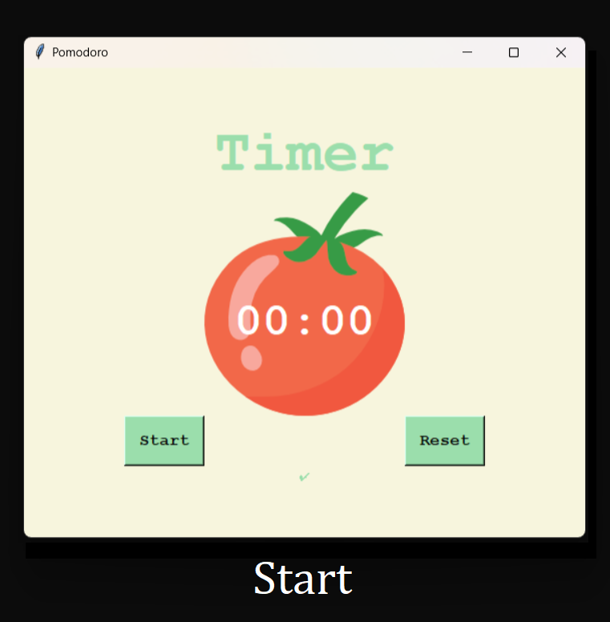
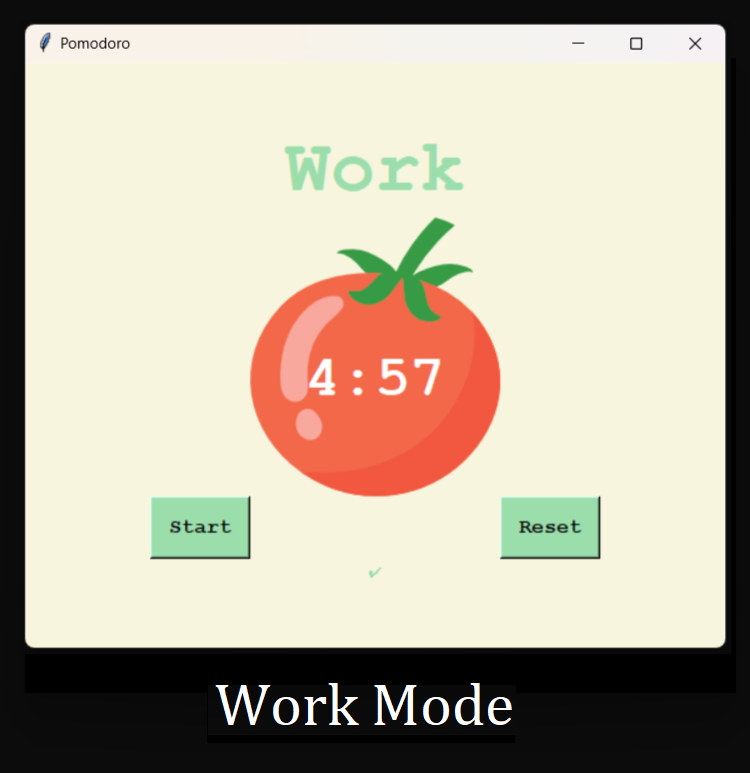

# Pomodoro Timer
A simple Pomodoro timer app created in Python.

## About Pomodoro
Pomodoro timer is a time management technique developed by Francesco Cirillo in the late 1980s. It involves breaking work into focused 25-minute intervals, separated by short breaks. The method is designed to improve productivity and concentration by helping users maintain focus on a task without distractions or interruptions. The Pomodoro timer is a tool used to measure and track these intervals and breaks, helping users to stick to the technique and achieve their goals.

## Features
Set a work duration and break duration
Start and stop the timer

## Installation
Clone the repository: git clone https://github.com/your-username/pomodoro-timer.git
Install the required packages: pip install -r requirements.txt

## Usage
Simply of the folder and run the main.py script
Click the "Start" button to start the timer
When the timer ends, it will notify you.
Click the "Stop" button to stop the timer

## Interface Images
<table>
            <tr>
                <td>
                    
                </td>
                <td>
                    
                </td>
            </tr>
        </table>

## Dependencies
This project requires the following packages:
<ul>
        <li>
            tkinter for the GUI
        </li>
    </ul>

## Contributing
Pull requests are welcome. For major changes, please open an issue first to discuss what you would like to change.

## Contact
If you have any questions or feedback regarding this project, please don't hesitate to contact me:
    <ul>
        <li>Email: [arpitsengar99@gmail.com](mailto:arpitsengar99@gmail.com)</li>
        <li>Linktree: [Arpit Sengar](https://linktr.ee/arpitwastaken)</li>
    </ul>
I'm always happy to hear from fellow developers and learn new things. Don't hesitate to reach out!
